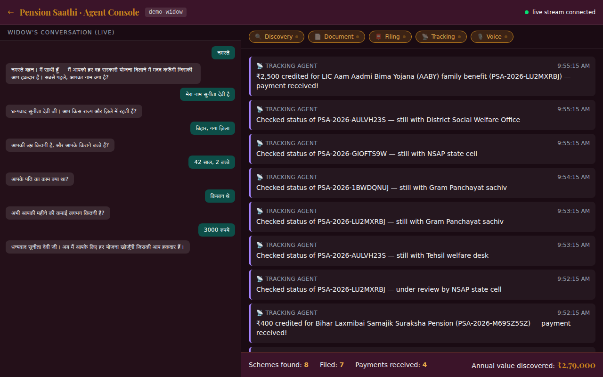

# Pension Saathi · पेंशन साथी

> **The agent that finds every rupee a widow is owed — and helps her claim it, from one photo.**

  



## The problem

About 1.5 crore widows in India are entitled to government pensions and welfare schemes. Roughly 70% never receive them. An estimated ₹50,000 crore a year sits unclaimed — because knowing which of dozens of schemes apply, filling forms in the right offices, and following up for months is too much for a newly widowed woman with low literacy and no one to help.

## What Saathi does — in one paragraph

A widow opens a chat (WhatsApp or the web) and talks to Saathi in her own language. Saathi asks her five simple questions, reads the photo of her husband's death certificate, and finds every scheme she qualifies for — central, state, insurance, gas, health. For the ones that can be filed online, Saathi files them and gives her tracking IDs. For the ones that need an office visit, Saathi tells her exactly which office, which papers to carry, and in what order. Then Saathi watches every claim until the money starts landing in her bank account.

## Try it yourself (3 minutes)

Sample widow profiles with fake documents ship in `docs/test-fixtures/personas/`. Pick one, upload its papers, and watch what happens.

| Persona folder | What she is | Roughly what you should see |
|---|---|---|
| `bihar-rural-laborer/` | Bihar widow, husband was a construction laborer | ~7 schemes including BOCW (construction workers') death benefit, ~₹4.5 lakh/year |
| `telangana-farmer/` | Telangana widow, husband was a farmer | ~7 schemes including Rythu Bima (₹5 lakh farmer insurance), ~₹7.7 lakh/year |
| `ap-govt-teacher/` | Andhra Pradesh widow, husband was a government teacher | Central Family Pension + Compassionate Appointment (BPL schemes correctly excluded) |
| `karnataka-private-driver/` | Karnataka widow, husband was a private driver | EPS-95 (EPF widow pension) + Karnataka Vidhava Vetana |

Two ways to try:

**Fastest — pre-loaded demo widow.** Open `/dashboard/demo-widow`. Sunita Devi, Bihar, ~8 schemes worth ₹2.79 lakh/year, everything already discovered.

**Full flow — talk to Saathi as a widow.** Open `/chat`. Pick a language. Say *"नमस्ते"* / *"నమస్తే"* / *"hello"*. Answer the five questions. When Saathi asks for the death certificate, upload one from a persona folder above. Watch the live Agent Console at `/dashboard/{yourWidowId}` — every step is streamed there.

### What each Agent Console log line means

- `🎙️ voice agent  Onboarding step N/5 — listening` — the 5-question intake
- `📄 document agent  OCR'd death certificate on-server (N chars)` — the image was read *on our server* (not sent to Google); only the extracted text goes to the AI
- `🔍 discovery agent  Fetched fresh web context (tavily)` — a dedicated web-search API pulled fresh policy info for the AI to consider
- `🔍 discovery agent  12 schemes ruled out by eligibility rules` — the conflict engine (hand-written rules) filters ineligible schemes before any AI call
- `⏸ Pipeline HALTED — Sukanya Samriddhi Yojana matches only if a daughter is under 10` — one scheme depends on a fact we don't know; Saathi asks the widow before confirming it
- `📮 filing agent  Submitted X online — Tracking ID PSA-2026-…` — filing (simulated — see honesty section below)
- `📡 tracking agent  ₹16,667 credited via DBT — first payment received!` — a simulated DBT (Direct Benefit Transfer) landing to show the end state

### Proving the privacy claims

Documents are stored encrypted at rest. Prove it with one line:

```bash
sqlite3 backend/data/pension_saathi.db \
  "SELECT substr(extracted_data,1,30) FROM documents ORDER BY id DESC LIMIT 1;"
```

Output starts with `enc-gcm:v1:…` — that's the ciphertext prefix, not readable JSON. The plaintext only appears when the API decrypts it just-in-time.

## What's real vs what's simulated

Being honest with the judges — here's exactly what runs live and what's staged.

**Really working:**

- **Voice** — Sarvam AI does the speech-to-text and text-to-speech for real (Indian languages/accents). Web browsers use their built-in speech engine when the language is installed; Sarvam is the fallback.
- **OCR** (reading text from images) — Tesseract runs on our server. Raw photos never leave the box.
- **Encryption** — the text extracted from photos is encrypted with AES-GCM (the same encryption banks use) before it's written to the database.
- **Web search** — Tavily is called directly for fresh policy information; the results are passed to the AI as extra context. We do *not* use Gemini's built-in search.
- **AI reasoning** — real Google Gemini calls, with automatic fallback to Groq if Gemini's free-tier limit is hit.
- **Eligibility rules** — hand-written from the actual scheme documents. `services/rag.py` filters wrong-state, wrong-age, wrong-employment-sector schemes before any AI call.
- **The 20 schemes** in `backend/data/schemes.json` are real central and state schemes.

**Simulated (for the hackathon):**

- **Actual filing to government portals.** Saathi generates a realistic tracking ID (`PSA-2026-XXXXXXXX`) and stores it, but does *not* actually POST to nsap.nic.in / pmjay.gov.in / etc. Each portal needs a partnership integration, which is not a hackathon-week task.
- **DBT (Direct Benefit Transfer) payments.** The tracking loop transitions claims from `filed → tracking → received` on a timer with realistic messages. No real money moves.
- **WhatsApp channel.** The backend code is complete — webhook verification, media download, Sarvam voice-note handling, image OCR. But the WhatsApp Business API needs Meta to verify our business account (a 5–10 day process outside code). Today the demo runs on the web `/chat` — the same agent pipeline underneath.
- **Document-vs-widow name cross-check.** If a widow says her name is "Anita" but uploads Sunita's Aadhaar, Saathi currently extracts "Sunita" and continues. The Tracking Agent simulates a portal rejection for name mismatches (which is what really happens at portals), but explicit name reconciliation is a post-hackathon addition.

This design lets judges exercise every code path end-to-end without waiting on any external partnership.

## How Saathi is built

Five agents talking to each other, orchestrated by [LangGraph](https://langchain-ai.github.io/langgraph/) (a Python framework for multi-agent state machines):

- **Voice Agent** — the 5-question onboarding conversation, in her language
- **Document Agent** — reads the death certificate (and Aadhaar, bank passbook, ration card) with local OCR
- **Discovery Agent** — finds every scheme she qualifies for by combining a stored rulebook with fresh web context
- **Filing Agent** — prepares each application, files what can be filed online, gives an action plan for the rest
- **Tracking Agent** — watches each claim's status and tells her when money arrives

Everything an agent does is written to a live event stream, so the dashboard at `/dashboard/{widowId}` shows exactly what's happening in real time.

## Tech choices

| Layer | Choice | Why |
|-------|--------|-----|
| Reasoning AI | Google Gemini (`gemini-flash-latest`) | Free tier, fluent in Indian languages |
| AI fallback | Groq (`llama-3.3-70b-versatile`) | Kicks in automatically when Gemini's rate limit is hit |
| Multi-agent flow | LangGraph | Handles the "pause and ask a question, then resume" pattern |
| Scheme search | ChromaDB (vector database) | Semantic match over the scheme rulebook |
| Voice (server) | Sarvam AI | Trained for Indian languages and accents |
| Voice (browser) | Web Speech API | Free, works on-device where the language is installed |
| Web search | Tavily API | Purpose-built search for AI agents |
| OCR (image → text) | Tesseract | Runs on our own server; no images to Google |
| Encryption at rest | AES-GCM (via `cryptography`) | Industry standard, same as banks and messengers |
| Backend | FastAPI (Python) | Simple, fast, auto-generates the API docs at `/docs` |
| Frontend | Next.js 15 + TypeScript | One-command deploy to Vercel |
| Database | SQLite | File-based, zero config, ships in the repo |
| Hosting | Render + Vercel (free tiers) | Total operating cost: ₹0 |

Without API keys the backend runs in *mock mode* — deterministic canned responses so the flow can be tested end-to-end offline.

## How privacy is handled

Three simple rules:

1. **Photos never leave our server.** When a widow uploads a document, Tesseract reads the text on our machine. Only the extracted text goes to the AI — never the image bytes.
2. **The extracted text is encrypted before it hits the database.** Even someone with SQLite access sees ciphertext (`enc-gcm:v1:…`), not names or Aadhaar numbers.
3. **Web search is a search problem, not an AI problem.** We call Tavily directly to fetch fresh public info about schemes and pass those snippets to the AI as extra context. This is cheaper, faster, and auditable.

`GET /health` shows all three privacy flags at a glance: `server_side_ocr`, `docs_encrypted_at_rest`, `web_search_provider`.

## Run locally

**Prerequisites:** Node 20+, Python 3.11+, Git, and Tesseract (see below).

```bash
git clone https://github.com/bhargavi-46/pension-saathi.git
cd pension-saathi

# Backend
cd backend
python -m venv .venv
source .venv/bin/activate            # Windows: .venv\Scripts\Activate.ps1
pip install -r requirements.txt
uvicorn main:app                     # http://localhost:8000

# Frontend (new terminal)
cd frontend
npm install
npm run dev                          # http://localhost:3000
```

Then open http://localhost:3000/dashboard/demo-widow.

### API keys (optional but recommended)

Create `backend/.env` with any of these — the flow degrades gracefully if a key is missing:

```
GOOGLE_API_KEY=...          # Gemini — get free at aistudio.google.com
GROQ_API_KEY=...            # AI fallback
SARVAM_API_KEY=...          # Indian voice
TAVILY_API_KEY=...          # Web search
OCR_ENCRYPTION_KEY=...      # See below
```

Generate an encryption key:

```bash
python -c "import secrets, base64; print(base64.b64encode(secrets.token_bytes(32)).decode())"
```

### Installing Tesseract (the OCR engine)

- **Ubuntu/Debian:** `sudo apt-get install -y tesseract-ocr tesseract-ocr-hin tesseract-ocr-tel tesseract-ocr-tam`
- **macOS:** `brew install tesseract tesseract-lang`
- **Windows:** [UB-Mannheim installer](https://github.com/UB-Mannheim/tesseract/wiki). During install, tick Hindi/Telugu/Tamil under "Additional language data". Then add this line to `backend/.env`:
  ```
  TESSERACT_CMD=C:\Program Files\Tesseract-OCR\tesseract.exe
  ```

### Troubleshooting

- `/health` shows `server_side_ocr: false` — Tesseract not found. On Windows, set `TESSERACT_CMD` in `.env`.
- `/health` shows `mock_mode: true` — no `GOOGLE_API_KEY` in `.env`. Add it and restart.
- Windows backend reloads endlessly — OneDrive touches files. Run `uvicorn main:app` without `--reload`, or move the project outside OneDrive.
- CORS error in the browser — set `NEXT_PUBLIC_API_URL` in the frontend to your backend URL.

## Project structure

```
pension-saathi/
├── backend/
│   ├── main.py                  # API routes + live event stream
│   ├── db.py                    # Database models
│   ├── agents/
│   │   ├── onboarding_agent.py  # 5-question intake
│   │   ├── document_agent.py    # OCR → encrypt → AI extract
│   │   ├── discovery_agent.py   # Scheme search + eligibility reasoning
│   │   ├── filing_agent.py      # Tracking IDs + action plans
│   │   └── tracking_agent.py    # Background status watcher
│   ├── services/
│   │   ├── gemini.py            # Gemini + Groq fallback
│   │   ├── voice.py             # Sarvam AI speech
│   │   ├── ocr.py               # Local Tesseract OCR
│   │   ├── crypto.py            # AES-GCM encryption
│   │   ├── web_search.py        # Tavily / Serper / Brave
│   │   ├── rag.py               # Scheme search + conflict engine
│   │   └── whatsapp_client.py   # WhatsApp Business API
│   ├── data/schemes.json        # 20 real central + state schemes
│   └── scripts/seed_demo.py     # Loads the demo widow at startup
├── frontend/
│   ├── app/chat/                # The chat interface
│   ├── app/dashboard/           # The live Agent Console
│   └── hooks/useVoice.ts        # Voice input + output
├── docs/test-fixtures/personas/ # Sample widows + fake documents
├── render.yaml                  # One-click backend deploy config
└── ATTRIBUTIONS.md              # Every OSS library credited
```

## Deploying

- **Backend to Render.** The included `render.yaml` installs Tesseract at build time. Push the branch, create a Blueprint service on Render, paste your API keys in the dashboard.
- **Frontend to Vercel.** Import the repo, set the root directory to `frontend/`, and add `NEXT_PUBLIC_API_URL` pointing at your Render URL.

## Roadmap

- Connect DigiLocker so the widow can pull her official documents automatically
- Complete WhatsApp Business verification with Meta and flip the delivery channel
- Replace simulated filings with real submissions to `nsap.nic.in`, `pmuy.gov.in`, `pmjay.gov.in`
- Cross-check widow name against extracted document names; block filing on mismatch
- Auto-ingest fresh scheme announcements from Tavily into the local rulebook
- Add Bhashini (Government of India) as a third voice provider for widest coverage
- More test personas — Kerala fisherman, Rajasthan silicosis widow, Odisha migrant family
- Consent dashboard where the widow sees and revokes every piece of stored data
- Escalation agent that auto-drafts RTIs and ombudsman appeals when a claim stalls

## License

MIT — see [LICENSE](LICENSE). Every open-source library and government data source is credited in [ATTRIBUTIONS.md](ATTRIBUTIONS.md).

## Team

**Piridi Bhargavi** — solo build for **ScriptedByHer 2.0** (Meesho).

> *"She has been waiting. Let's stop making her wait."*
